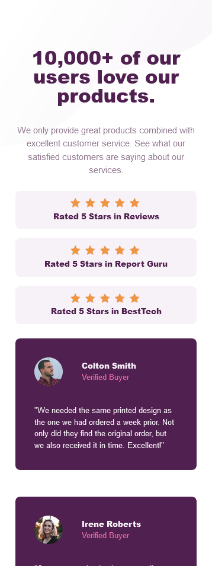
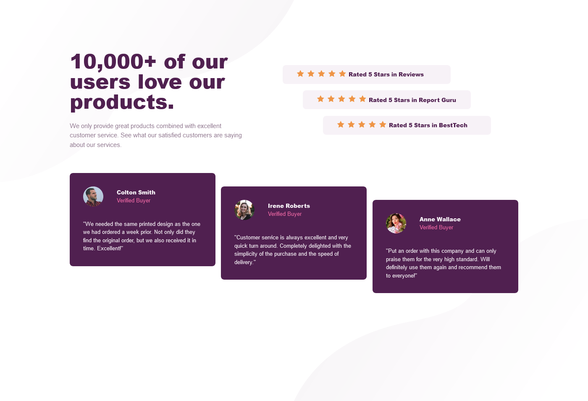

# Frontend Mentor - Social proof section solution

This is a solution to the [Social proof section challenge on Frontend Mentor](https://www.frontendmentor.io/challenges/social-proof-section-6e0qTv_bA). Frontend Mentor challenges help you improve your coding skills by building realistic projects.

## Table of contents

- [Overview](#overview)
  - [The challenge](#the-challenge)
  - [Screenshot](#screenshot)
  - [Links](#links)
- [My process](#my-process)
  - [Built with](#built-with)
- [Author](#author)
- [Acknowledgments](#acknowledgments)

## Overview

### The challenge

Users should be able to:

- View the optimal layout for the section depending on their device's screen size

### Screenshot

### Links

- Solution URL: [https://www.frontendmentor.io/solutions/solution-with-senantic-html-css-flex-and-grid-and-sass-8AAfCNDUQN]
- Live Site URL: [https://jeffhill-io-social-proff-section.netlify.app/]

## My process

### Built with

- Semantic HTML5 markup
- Sass
- Flexbox
- CSS Grid

## Author

- Website - [https://jeffhill.io/](https://www.your-site.com)
- Frontend Mentor - [https://www.frontendmentor.io/profile/webdevhill](https://www.frontendmentor.io/profile/yourusername)

## Acknowledgments

Shout out to Kevin Powell on this one. He explains how he approaches and thinks through the design. He emphasises semantic HTML and it was a good project to review SASS. Great teacher and channel that I highly recommend.

[https://www.youtube.com/watch?v=K27WULzr2P8&t=7936s]
